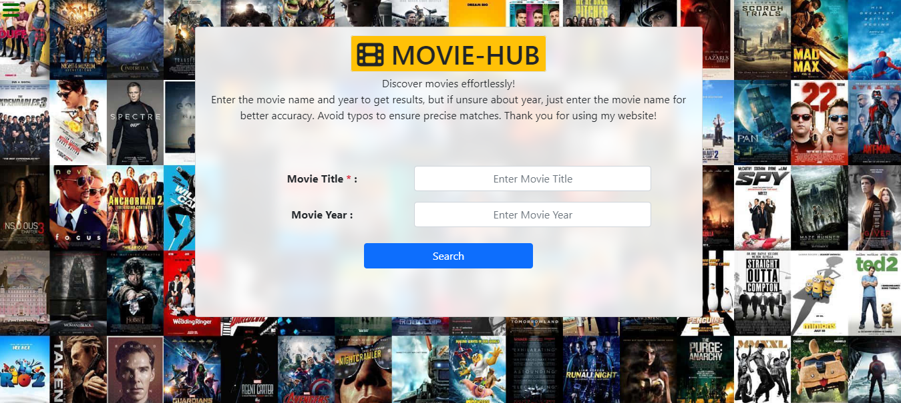

# Movie-Hub

It's a search movie by name and get it's info displaying website which was designed by me. It's my Guvi-Zen class Day-20 (Async : Day-5) Task.

## Tech Stack

- HTML
- CSS
- Javascript
- Bootstrap

## Features

- Responsive and Interactive Design

## Lessons Learned

I learned to fetch the API data using async method and error handling method in Javascript.

## Website

[Movie-Hub]()

## Screenshots

## Feedback

If you have any feedback, please reach out to me at vijaymayhul@gmail.com
